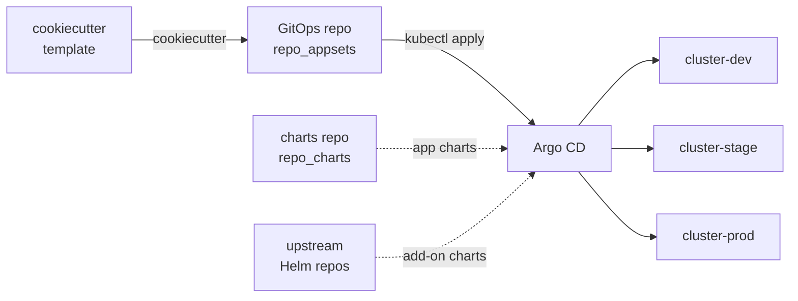

# cookiecutter-gitops-multirepo

A Cookiecutter template for generating an Argo CD GitOps configuration repository.

The generated repository is intended to act as the application-set configuration layer for a Kubernetes platform. It bootstraps Argo CD from a Git repository, defines `ApplicationSet` resources, and stores per-cluster Helm values for platform add-ons and applications.

## Overview

**How the template fits together**



The template renders the **configuration** repo (`repo_appsets`). At runtime Argo CD
combines that config with **charts** from a separate private repo (`repo_charts`)
and add-on charts pulled from upstream public Helm repositories, then reconciles
every cluster. The two-repository split is described under
[Repository Relationships](#repository-relationships).

## What This Template Generates

The template creates a GitOps repository with this shape (cluster directory names come from the `cluster_dev`, `cluster_stage`, and `cluster_prod` inputs; their defaults are shown):

```text
<project_slug>/
  README.md
  bootstrap.yaml
  bootstrap/
    appset-apps.yaml
    appset-addons.yaml
  clusters/
    cluster-dev/
      addons/
        metrics-server.yaml
      apps/
        podinfo.yaml
    cluster-stage/
      addons/
      apps/
    cluster-prod/
      addons/
      apps/
```

Key generated files:

- `bootstrap.yaml` - an Argo CD `Application` that recursively syncs the generated `bootstrap/` directory.
- `bootstrap/appset-apps.yaml` - an `ApplicationSet` (list generator) for workload applications. It ships one entry per (app x cluster) and pins a chart revision per cluster: dev tracks the chart repo's `main` branch, while stage and prod pin released tags (stage ahead of prod, so changes soak before promotion). The sample app is `podinfo`.
- `bootstrap/appset-addons.yaml` - an `ApplicationSet` (matrix generator) for cluster add-ons, deployed at the same version to every cluster. The sample add-on is `metrics-server`.
- `clusters/<cluster>/apps/*.yaml` - per-cluster Helm values for applications.
- `clusters/<cluster>/addons/*.yaml` - per-cluster Helm values for platform add-ons.

Both `ApplicationSet` resources use Argo CD multi-source applications: per-cluster values come from this GitOps repository (under `clusters/`), while the chart comes from a separate source. Application charts are pulled from the private chart repository (`repo_charts`); add-on charts are pulled from each add-on's upstream public Helm repository (for example `https://kubernetes-sigs.github.io/metrics-server/` for metrics-server).

The generated repository ships with its own `README.md` documenting the rendered layout.

## Template Inputs

The prompts are defined in `cookiecutter.json`:

| Variable | Purpose |
| --- | --- |
| `platform_name` | Human-readable platform name used in the generated repository's documentation. |
| `argo_namespace` | Namespace of the Argo CD installation. Used in `bootstrap.yaml` and the bootstrap `kubectl apply` command. Defaults to `argocd`. |
| `project_name` | Display name for the generated GitOps repository. |
| `project_slug` | Directory name for generated output. Derived from `project_name` by default (lowercased, with `:` removed and spaces replaced by underscores). The `pre_gen_project.py` hook rejects slugs that do not match `^[_a-zA-Z][_a-zA-Z0-9]+$`. |
| `repo_appsets` | GitHub repository (`owner/name`) that will hold the generated ApplicationSet and values configuration. |
| `repo_charts` | GitHub repository (`owner/name`) that contains the private Helm charts consumed by the applications `ApplicationSet`. |
| `repo_appsets_branch` | Branch Argo CD should track for the ApplicationSet and values files. Defaults to `main`. |
| `cluster_dev` | Name of the dev cluster, as registered in Argo CD. |
| `cluster_stage` | Name of the stage cluster, as registered in Argo CD. |
| `cluster_prod` | Name of the prod cluster, as registered in Argo CD. |
| `init_git` | Whether the `post_gen_project.py` hook runs `git init` and creates an initial commit in the generated repository (on the `repo_appsets_branch` branch). Defaults to `true`. |
| `github_username` | GitHub org or user that owns the release-sensitive paths (`bootstrap/`, `clusters/<prod>/`, `.github/`). Rendered into the generated `.github/CODEOWNERS`. |

## Prerequisites

Install:

- Python 3
- Cookiecutter
- Git
- `kubectl` with access to the Argo CD control-plane cluster (to apply `bootstrap.yaml`)
- Access to the target GitHub repositories from Argo CD

The `pre_gen_project.py` hook validates the generated `project_slug` before rendering: it must start with a letter or underscore and contain only letters, numbers, and underscores.

## Generate a Repository

Run Cookiecutter from a local checkout:

```bash
cookiecutter .
```

Or run it directly from GitHub:

```bash
cookiecutter gh:kriipke/cookiecutter-gitops-multirepo
```

Cookiecutter writes the generated repository into the selected `project_slug` directory. With `init_git` left as `true` (the default), the `post_gen_project.py` hook initializes it as a Git repository with an initial commit on the `repo_appsets_branch` branch.

## Configure the Generated Repository

After generation:

1. Review `bootstrap.yaml` and confirm the Argo CD namespace (`argo_namespace`), repository URL (`repo_appsets`), and target branch (`repo_appsets_branch`).
1. Update `bootstrap/appset-apps.yaml` with the applications, chart paths, target revisions, release names, environments, and cluster selectors for your platform.
1. Update `bootstrap/appset-addons.yaml` with the add-ons, chart repositories, versions, and target clusters you want Argo CD to manage.
1. Replace the sample values under `clusters/` with real per-cluster and per-environment Helm values.
1. Commit and push the generated repository to the repository referenced by `repo_appsets`.
1. Apply `bootstrap.yaml` to the Argo CD control-plane cluster.

Example bootstrap command (substitute your `argo_namespace`):

```bash
kubectl apply -n argocd -f bootstrap.yaml
```

## Repository Relationships

The generated GitOps repository expects two repository roles:

- ApplicationSet and values repository - generated from this template and referenced by `repo_appsets`. Holds the `ApplicationSet` resources and the per-cluster Helm values under `clusters/`.
- Helm chart repository - referenced by `repo_charts` and used as the private chart source for the applications `ApplicationSet`.

Add-on charts are not pulled from `repo_charts`; they come directly from each add-on's upstream public Helm repository.

The generated `ApplicationSet` resources use Argo CD multi-source applications so that chart templates can live in their respective chart sources while environment values live in the GitOps repository.

## Development Notes

This repository is the template source. The nested `{{ cookiecutter.project_slug }}/README.md` file documents the generated repository, not this template repository.

The generated repository also ships CI under `{{ cookiecutter.project_slug }}/.github/`: a render gate plus promotion workflows (documented in the generated `docs/promoting-chart-upgrades.md`). These workflow, composite-action, and script files are listed in `_copy_without_render` in `cookiecutter.json` so they are copied verbatim - GitHub Actions `${{ ... }}` expressions would otherwise collide with cookiecutter's Jinja `{{ ... }}` and break rendering. As a consequence those files must contain **no cookiecutter variables**; they self-discover apps, clusters, tags, and the charts repo by parsing `bootstrap/appset-apps.yaml` at runtime. (`.github/CODEOWNERS` is intentionally *not* copied verbatim, so it can render the prod cluster name.)

When changing the template:

- Keep `cookiecutter.json` in sync with variables referenced in hooks and rendered files.
- Prefer adding sample clusters, add-ons, and applications as minimal examples that users can replace.
- Render the template locally after editing and review the generated YAML before publishing changes.
- Avoid committing generated output except for files that are part of the Cookiecutter template itself.
- Do not put `{{ cookiecutter.* }}` variables in `.github/workflows/`, `.github/actions/`, or `.github/scripts/` - they are copied verbatim. Requires cookiecutter >= 2.x.

## License

Released under the MIT License. See [`LICENSE`](LICENSE).
