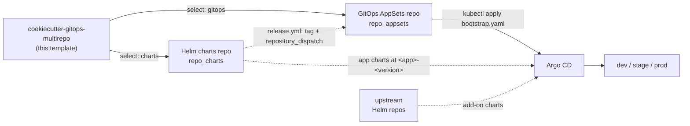

# cookiecutter-gitops-multirepo

A **multi-level Cookiecutter template** for an Argo CD GitOps platform built on the
two-repository (multirepo) model. One template repository, two selectable child
templates:

| Choose | Generates | Role |
| --- | --- | --- |
| **`gitops`** | the **GitOps AppSets** repo (`repo_appsets`) | Argo CD `ApplicationSet` resources under `bootstrap/` and per-cluster Helm values under `clusters/`. The single source of truth for *what runs where*. |
| **`charts`** | the **Helm charts** repo (`repo_charts`) | Private application charts under `charts/<app>/`, released as `<app>-<version>` git tags. The chart source the AppSets reference. |



At runtime Argo CD combines the **config** (AppSets repo) with **charts** (the charts
repo) and add-on charts from upstream public Helm repos, then reconciles every
cluster. The two repos are generated from the same inputs so they line up - the
charts repo's `charts/<app>/` paths and `<app>-<version>` tags are exactly what the
AppSets `ApplicationSet` pins.

## How the multi-level template works

This repository uses Cookiecutter's native
[nested configuration](https://cookiecutter.readthedocs.io/en/stable/advanced/nested_config_files.html)
(requires **Cookiecutter >= 2.5**). The root `cookiecutter.json` is a pure selector:

```json
{
  "templates": {
    "gitops": { "path": "./gitops", "title": "GitOps configs (AppSets) repo", "description": "..." },
    "charts": { "path": "./charts", "title": "Helm charts repo", "description": "..." }
  }
}
```

Each child (`gitops/`, `charts/`) is a complete, independent Cookiecutter template
with its own `cookiecutter.json`, hooks, and template tree.

> **One template per run.** The native selector generates **one** child at a time -
> it is a menu, not a "generate both" orchestrator. To stand up a full platform,
> run it twice (once for `gitops`, once for `charts`) and answer the shared inputs
> (`platform_name`, `repo_appsets`, `repo_charts`, ...) **identically** both times so
> the two repos reference each other correctly.

### Generate

Interactive selector (pick `gitops` or `charts` from the menu):

```bash
cookiecutter .
# or straight from GitHub:
cookiecutter gh:kriipke/cookiecutter-gitops-multirepo
```

Run a specific child non-interactively with `--directory`:

```bash
cookiecutter . --directory gitops
cookiecutter . --directory charts
```

Each child's `post_gen_project.py` initializes the output as its own Git repository
with an initial commit (toggle with `init_git`) - matching the multirepo model where
the AppSets repo and the charts repo are genuinely separate repositories.

## Children

### `gitops/` - GitOps AppSets repo

Generates the configuration repo: `bootstrap.yaml`, the `applications` and `addons`
`ApplicationSet` resources under `bootstrap/`, and per-cluster Helm values under
`clusters/<cluster>/{apps,addons}/`. Ships CI (a render gate plus promotion
workflows) under `.github/`. The sample app is `podinfo`; the sample add-on is
`metrics-server` (add-on charts come from upstream public Helm repos, not the charts
repo). The generated repo carries its own `README.md` and `docs/`.

Inputs (`gitops/cookiecutter.json`): `platform_name`, `argo_namespace`,
`project_name`/`project_slug`, `repo_appsets`, `repo_charts`, `repo_appsets_branch`,
`cluster_dev`/`cluster_stage`/`cluster_prod`, `github_username`, `init_git`.

### `charts/` - Helm charts repo

Generates the private chart repo: `charts/<app>/` (a vendored **podinfo** sample, with
a strict `values.schema.json`), `ct.yaml` + `.github/workflows/lint-test.yml` running
Helm [chart-testing](https://github.com/helm/chart-testing) (`ct lint` + `ct install`
on kind) over changed charts, and `cr.yaml` + `.github/workflows/release.yml` enforcing
the SemVer-as-values contract and using
[chart-releaser](https://github.com/helm/chart-releaser) to publish each chart as a
GitHub Release tagged `<app>-<version>`, then dispatching the AppSets repo on release.
The release workflow reads the AppSets repo from the `APPSETS_REPO` Actions variable
(see the generated repo's `README.md`).

Inputs (`charts/cookiecutter.json`): `platform_name`, `project_name`/`project_slug`,
`repo_charts`, `repo_appsets`, `github_username`, `default_branch`, `init_git`.

## Prerequisites

- Python 3 and **Cookiecutter >= 2.5** (native nested-template selector)
- Git
- `helm` (to lint/render charts) and `kubectl` with access to the Argo CD
  control-plane cluster (to apply the GitOps repo's `bootstrap.yaml`)
- Access to the target GitHub repositories from Argo CD

Both children validate `project_slug` in `pre_gen_project.py`: it must start with a
letter or underscore and contain only letters, numbers, and underscores.

## Development notes

This repository is the template source. The detailed docs for each *generated* repo
live inside that child's template tree (e.g.
`gitops/{{ '{{' }} cookiecutter.project_slug {{ '}}' }}/README.md` and `docs/`).

- Keep each child's `cookiecutter.json` in sync with the variables referenced in its
  hooks and rendered files.
- **`_copy_without_render`** matters in both children. In `gitops/` the GitHub
  Actions files under `.github/{workflows,actions,scripts}/` are copied verbatim
  because their `${{ '{{' }} ... {{ '}}' }}` expressions would collide with Jinja. In
  `charts/` the entire vendored chart under `charts/*` (full of Helm `{{ '{{' }} ...
  {{ '}}' }}` templating) and `.github/workflows/*` (including `lint-test.yml`) are
  copied verbatim. Files outside those globs (READMEs, `CODEOWNERS`, `NOTICE`,
  `cr.yaml`, and `ct.yaml` - whose `target-branch` renders from `default_branch`)
  still render.
- The `charts/` child vendors the upstream **podinfo** chart (Apache-2.0) as a sample;
  see the generated `NOTICE`. Replace it with your own charts - only the
  `charts/<app>/` layout and the `<app>-<version>` tag contract are load-bearing.
- Render each child locally after editing and review the output before publishing.

## License

Released under the MIT License. See [`LICENSE`](LICENSE). Vendored sample charts retain
their own licenses (see the generated `charts` repo's `NOTICE`).
