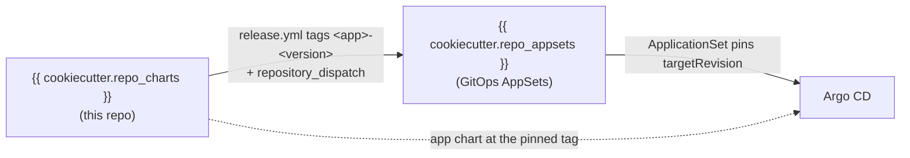

# {{ cookiecutter.project_name }}

Private Helm charts for the **{{ cookiecutter.platform_name }}** Kubernetes platform.

This is the **charts** half of a two-repository GitOps setup. It holds the
application charts (`charts/<app>/`); the companion **GitOps AppSets** repository
(`{{ cookiecutter.repo_appsets }}`) holds the Argo CD `ApplicationSet` resources and
per-cluster values that point Argo CD at these charts. Both repositories are
generated from the same multi-level Cookiecutter template
(`cookiecutter-gitops-multirepo`): pick `charts` to (re)generate this repo, `gitops`
for the other.



## Layout

```text
charts/
  podinfo/            # one directory per application chart
    Chart.yaml
    values.yaml
    values.schema.json
    templates/        # includes templates/tests/* (helm test hooks)
ct.yaml               # chart-testing (ct) configuration
cr.yaml               # chart-releaser (cr) configuration
.github/
  workflows/
    lint-test.yml     # PR: ct lint + ct install (kind) - proves charts install & pass tests
    release.yml       # SemVer guard; release via chart-releaser; notify the AppSets repo
```

Each application has a chart under `charts/<app>/`. The sample shipped here is
**podinfo** (vendored from [stefanprodan/podinfo](https://github.com/stefanprodan/podinfo),
Apache-2.0 - see [`NOTICE`](NOTICE)). Replace or add charts for your own
applications; the only hard requirements are the `charts/<app>/` layout and the
versioning contract below.

## The versioning contract

Argo CD selects a chart by the git tag **`<app>-<version>`**, where `<version>` is
the chart's own `Chart.yaml` `version:` (not its `appVersion`, which tracks the
upstream application independently). The version follows a SemVer-as-values
contract:

| Bump | Meaning | Consumer action |
| --- | --- | --- |
| **MAJOR** (`X.0.0`) | Breaking values change - a key is renamed, moved, nested, retyped, or removed. | Must migrate the per-cluster values in the AppSets repo. |
| **MINOR** (`x.Y.0`) | Backward-compatible - a new optional key/block was added. | None; adopt when ready. |
| **PATCH** (`x.y.Z`) | No values impact (template/bugfix, `appVersion` bump). | None. |

Each chart ships a `values.schema.json` whose top-level keys are pinned
(`additionalProperties: false`), so a stale or renamed key fails loudly during
`helm template` in the AppSets repo's render gate.

How Argo CD consumes the tags (configured in the AppSets repo):

- **dev** tracks the `{{ cookiecutter.default_branch }}` branch (a moving target) and updates automatically.
- **stage** and **prod** pin released tags (stage ahead of prod) so a change soaks
  in stage before it is promoted to prod.

## CI

Two workflows, with a clean division of labour:

**`lint-test.yml` (pull requests)** runs Helm [chart-testing](https://github.com/helm/chart-testing)
(`ct`) on charts that changed versus `{{ cookiecutter.default_branch }}`: `ct lint`
on each, then `ct install` on an ephemeral kind cluster, which runs `helm install`
plus the chart's own `helm test` hooks (`templates/tests/*`). Configuration is in
[`ct.yaml`](ct.yaml). The vendored podinfo sample ships gRPC/JWT/service tests that
this exercises out of the box.

**`release.yml`** runs the **SemVer guard** on pull requests (the `Chart.yaml` bump
class must match the `values.yaml` diff) and lint/renders every chart so
`{{ cookiecutter.default_branch }}` stays valid. On push to
`{{ cookiecutter.default_branch }}` it uses [chart-releaser](https://github.com/helm/chart-releaser)
(`cr`, configured in [`cr.yaml`](cr.yaml)) to package every chart whose
`<app>-<version>` is not yet released and publish it as a **GitHub Release** tagged
`<app>-<version>`, then fires a `repository_dispatch` at the AppSets repo so it can
open a promotion PR. Argo CD consumes charts over git at that tag, so `cr`'s gh-pages
Helm index step is intentionally skipped - only the packaging + Release/tag is used.
`cr` creates Releases with the built-in `GITHUB_TOKEN`; only the cross-repo dispatch
needs `PROMOTE_DISPATCH_TOKEN`.

Configure once in **Settings -> Secrets and variables -> Actions**:

| Kind | Name | Value / purpose |
| --- | --- | --- |
| Variable | `APPSETS_REPO` | `owner/name` of the GitOps AppSets repo to notify (e.g. `{{ cookiecutter.repo_appsets }}`). |
| Secret | `PROMOTE_DISPATCH_TOKEN` | PAT or GitHub App token with `contents:write` on the AppSets repo (the default `GITHUB_TOKEN` cannot dispatch cross-repo). |

The AppSets repo also needs a read-only deploy key on this repo (`CHARTS_DEPLOY_KEY`)
so its render gate can clone these charts at a tag. See that repo's
`docs/promoting-chart-upgrades.md` for the full promotion flow.

## Releasing a chart

1. Edit the chart under `charts/<app>/` and bump `Chart.yaml` `version:` per the
   contract above (MAJOR if you renamed/removed a values key).
1. Open a PR. The SemVer guard fails if the bump class does not match the values
   diff; the lint/render job keeps `{{ cookiecutter.default_branch }}` valid for the
   dev environment.
1. Merge to `{{ cookiecutter.default_branch }}`. chart-releaser publishes a GitHub
   Release tagged `<app>-<version>` and the job notifies
   `{{ cookiecutter.repo_appsets }}`, which opens the stage promotion PR.

## Local checks

```bash
helm lint charts/podinfo
helm template smoke charts/podinfo >/dev/null

# Full install-test loop, as CI runs it (needs docker + kind + the `ct` CLI):
ct lint --config ct.yaml
ct install --config ct.yaml          # spins up kind, installs, runs helm test
```
